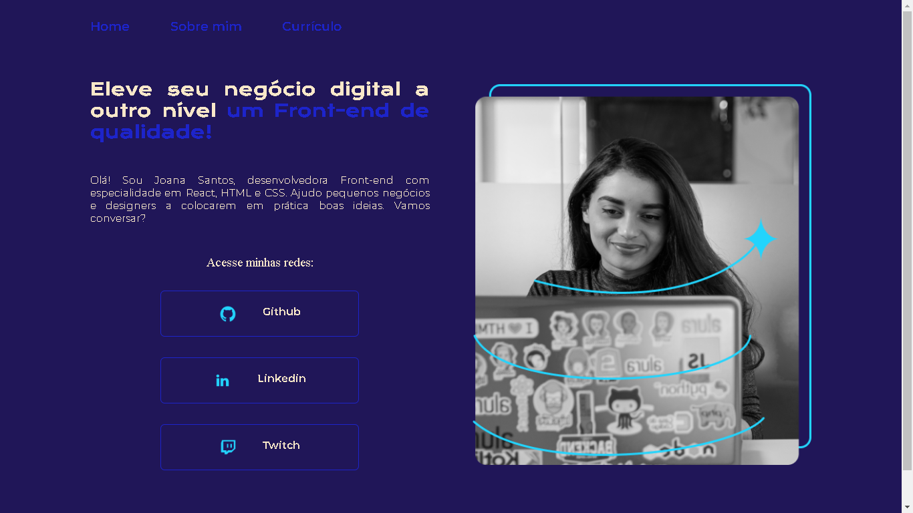
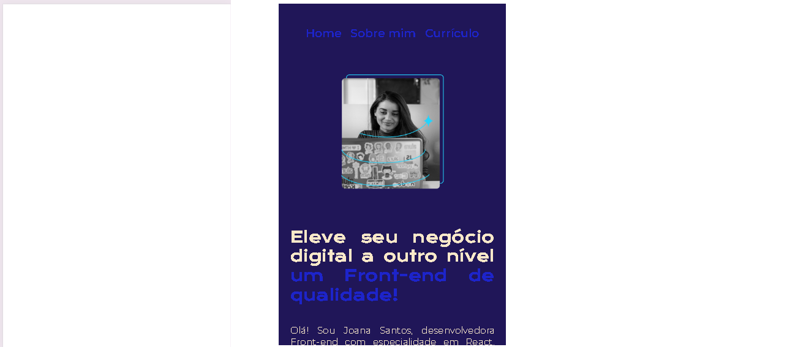

# Olá, Bem vindo ao meu projeto de portfólio.

Foi criado um modelo de portfolio durante a aula de HTML e CSS do Curso da Alura utilizando como referencia o projeto realizado 
pela Joana Santos.

Print da pagina inicial:

Printe da pagina responsiva:

## Ferramentas utilizadas:

* HTML

* CSS

## Aluno:

### Mauricio Alejandro. 

### Linkedin: https://www.linkedin.com/school/aluracursos/
modelo para a criação de um portfolio on-line, conforme aula do curso HTML e CSS da Alura.
